# fitness-landscape-design

**Which environments produce a given fitness landscape?**
Inverse design on a differentiable ODE model of two phage strains competing for bacterial hosts. The forward model maps an environment to a fitness landscape; this repository runs it backwards.

## The storyline

1. **One environment for a dome.** Given a dome-shaped target landscape, gradient descent through the ODE finds an environment that produces it.
2. **Many environments give the same dome.** The solution is not unique, and the set of solutions can be characterised.
3. **A two-peaked target is out of reach.** No single environment reproduces a bimodal landscape.
4. **A sequence of environments reaches it.** Extending the assay from one window of length $`T`$ to $`n`$ windows, and optimising the environment in each, makes bimodal landscapes attainable.
5. **From sampling solutions to the shape of the solution space.** Persistent homology and related tools describe the topology of the set of solutions, where steps 2–4 only sample it. (current work)

| Step | Question | Architecture | Status |
|---|---|---|---|
| 1 | Which environment gives this landscape? | Differentiable ODE, MSE loss, Adam | Done |
| 2 | Which *other* environments give it? | Multi-start optimisation; Jacobian identifiability; neural posterior estimation with a conditional neural spline flow | Done |
| 3 | Can one environment give two peaks? | Forward sweep of the attainable family; multi-start inverse design on 1D and 2D bimodal targets | Done |
| 4 | Can a sequence of environments? | Open-loop trajectory optimisation: windowed rollout with serial transfer, backprop through the whole sequence | Done |
| 5 | What is the shape of the solution set? | Persistent homology on sampled solutions | Planned |

## The model

A focal phage strain with phenotype $`\lambda`$ competes against a fixed reference strain in an environment $`\theta_\text{env}`$. Its relative fitness after an assay of length $`T`$ is

```math
F_\theta(\lambda) = \frac{1}{T}\log\frac{V_1(T)}{V_2(T)}
```

where $`V_1`$ and $`V_2`$ are the free-phage abundances of the focal and reference strains. Sweeping $`\lambda`$ with the environment held fixed gives the fitness landscape $`F_\theta(\lambda)`$.

- **Environment.** Five parameters: $`\theta_\text{env} = (B_0, M_0, r, K, \delta)`$.
- **Phenotype.** $`\lambda`$ sets the timing of lysis. Burst size follows the trade-off $`\beta(\lambda) = \rho\,(2/\lambda - \text{eclipse})`$, which is held fixed throughout: only the environment is optimised.
- **A hard constraint.** At $`\lambda = \lambda_\text{ref}`$ the two strains are identical, so $`F(\lambda_\text{ref}) = 0`$ for every environment. Across 200 random environments the largest deviation was $`2\times10^{-17}`$. Every target is built to satisfy it.

---

## 1. One environment for a dome

**Question.** Given a target landscape $`F^*(\lambda)`$ with a single peak, which environment produces it?

**Architecture.**

1. The existing ODE is used as a differentiable simulator, with its solver settings, state scaling and positivity transform unchanged.
2. Phage traits are strain-specific, so the focal phenotype varies while the reference stays fixed.
3. The landscape is evaluated at $`N`$ phenotype values with one shared environment.
4. The loss $`L(\theta_\text{env}) = \frac{1}{N}\sum_k \left[F_\theta(\lambda_k) - F^*(\lambda_k)\right]^2`$ is minimised with Adam, differentiating through every ODE solve.

```
θ_env ──► ODE solve at λ₁…λ_N ──► F_θ(λ) ──► MSE against F* ──► ∇θ ──► Adam update
   ▲                                                                        │
   └────────────────────────────────────────────────────────────────────────┘
```

**Result.** A known synthetic environment is recovered from its own landscape.

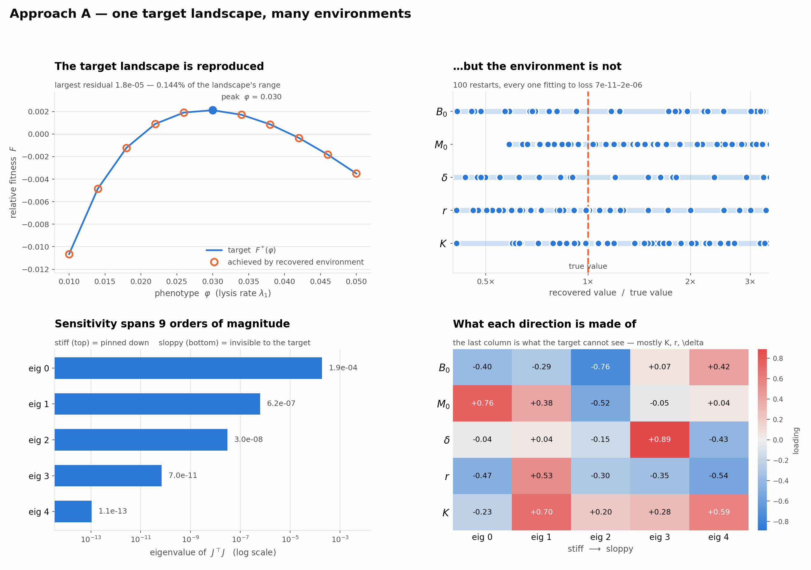

*Figure 1. Target landscape and the landscape of the optimised environment.*

## 2. Many environments give the same dome

**Question.** Is that environment the only one? If not, what does the set of solutions look like?

**Architecture.** Three tools, from local to global:

- **Multi-start optimisation.** The step-1 optimiser is run from 100 random initial environments. Restarts that reach the same loss with different parameters are different solutions.
- **Jacobian identifiability.** The Jacobian of the landscape with respect to $`\theta_\text{env}`$ at a solution. Directions with small singular values change the environment without changing the landscape.
- **Neural posterior estimation.** Environments are sampled from a prior and simulated, giving pairs $`(\theta_\text{env}, F)`$. A conditional neural spline flow is trained on them to approximate $`q(\theta_\text{env} \mid F)`$, so one trained model returns the whole family of environments for any target. Samples are run back through the ODE to check that they reproduce the target.

```
prior p(θ_env) ──► ODE ──► (θ_env, F) pairs ──► conditional spline flow q(θ_env | F)
                                                          │
                              F* ──► sample θ_env ──► ODE ──► compare with F*
```

**Result.** Environments that differ widely produce the same landscape.

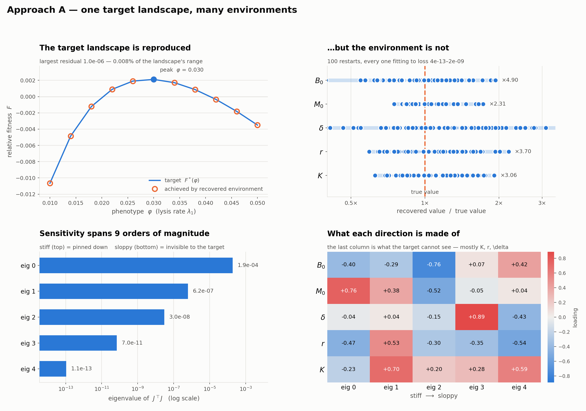

*Figure 2. 100 restarts of the step-1 optimiser.*

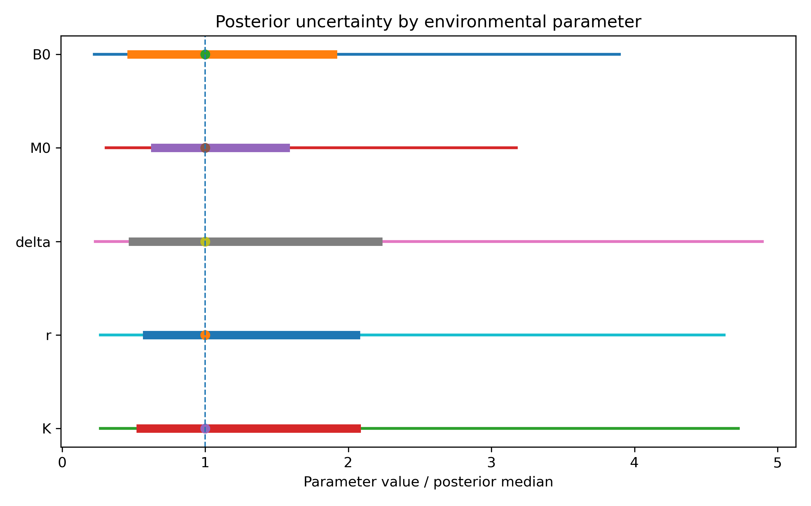

*Figure 3. Posterior over each environment parameter given the dome target. Wide intervals mark parameters the landscape does not pin down.*

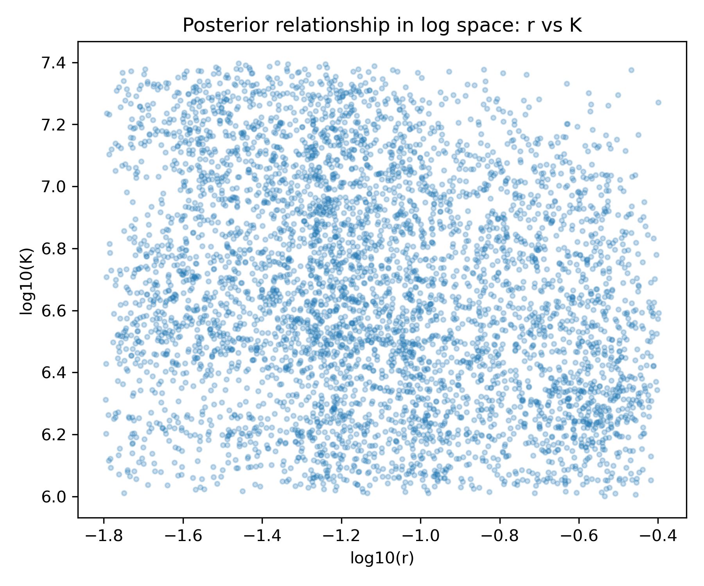

*Figure 4. Joint posterior for a pair of parameters. A ridge means the two can trade off against each other with no change in the landscape.*

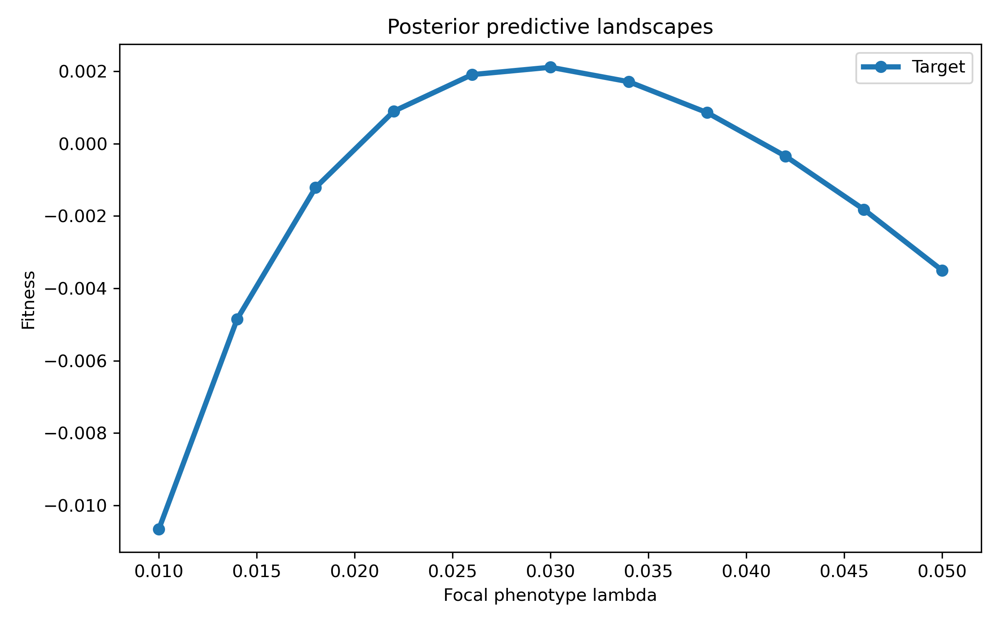

*Figure 5. Landscapes simulated from posterior samples, against the target.*

## 3. A two-peaked target is out of reach

**Question.** Can any single environment produce a landscape with two peaks?

**Architecture.** The phenotype model is held fixed and only the environment changes, so a failure is a statement about what the model can express and not an optimisation artefact.

- **Stage 0, forward sweep.** Sample environments widely and record the number of peaks, where the peak sits, and its height. This maps the family of landscapes the model can produce.
- **Stage 1, symmetric bimodal target.** Two equal peaks; the step-1 optimiser with 200 restarts.
- **Stage 2, asymmetric bimodal target.** Two unequal peaks; same optimiser.
- **Stage 3, 2D target.** Burst size is freed from the trade-off, so the landscape becomes a surface $`F(\lambda, \beta)`$ with two optima, such as (slow lysis, high burst) and (fast lysis, low burst); 75 restarts.

Bimodal targets are built from their derivative, so the peaks land exactly where specified and one parameter $`m`$ sets their relative height:

```math
F^{*\prime}(\lambda) = -c\,(\lambda-\lambda_a)(\lambda-\lambda_m)(\lambda-\lambda_b), \qquad \lambda_m = \lambda_a + m(\lambda_b-\lambda_a)
```

Peaks are counted on a finer grid than the one used for fitting, and by prominence, so solver noise is not read as an extra peak.

**Result.** In sweeps of 120 and 200 random environments, every landscape that was not monotone had exactly one peak. The peak moves across almost the whole grid ($`\lambda`$ = 0.012 to 0.046) as the environment changes, but it does not split. The current ODE model class appears unable to produce a bimodal $`F(\lambda)`$ by varying the environment alone.

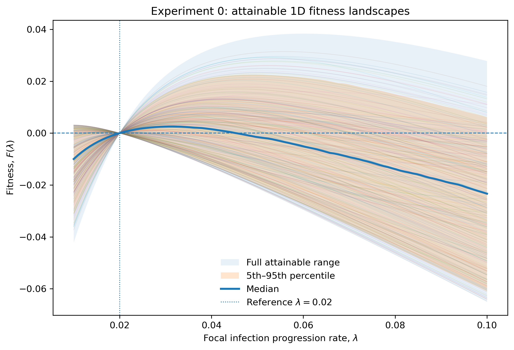

*Figure 6. Landscapes from the forward sweep: what one environment can produce.*

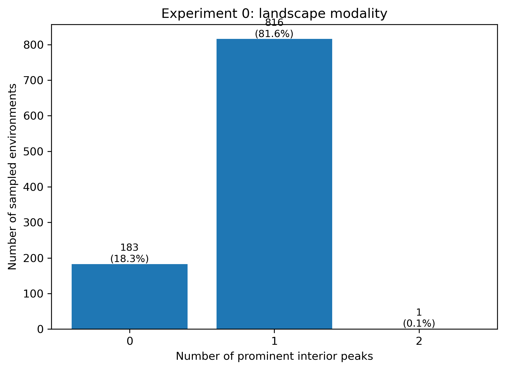

*Figure 7. Number of peaks per sampled environment.*

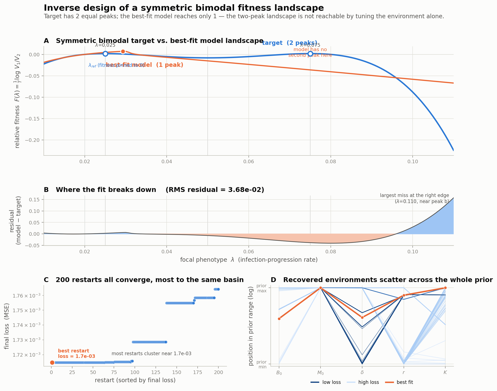

*Figure 8. Best fit to a symmetric two-peak target over 200 restarts.*

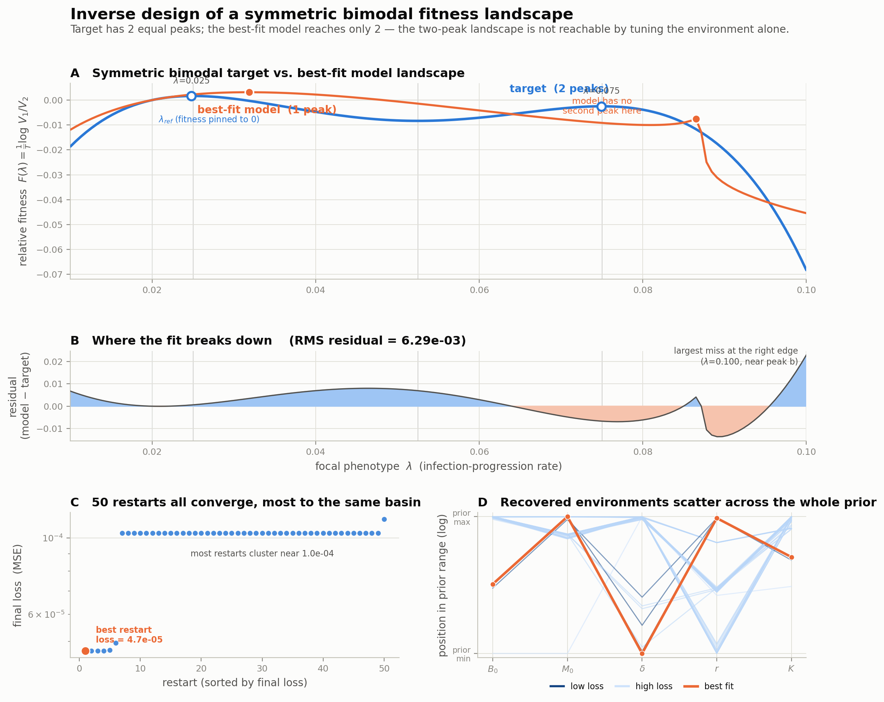

*Figure 9. Best fit to an asymmetric two-peak target.*

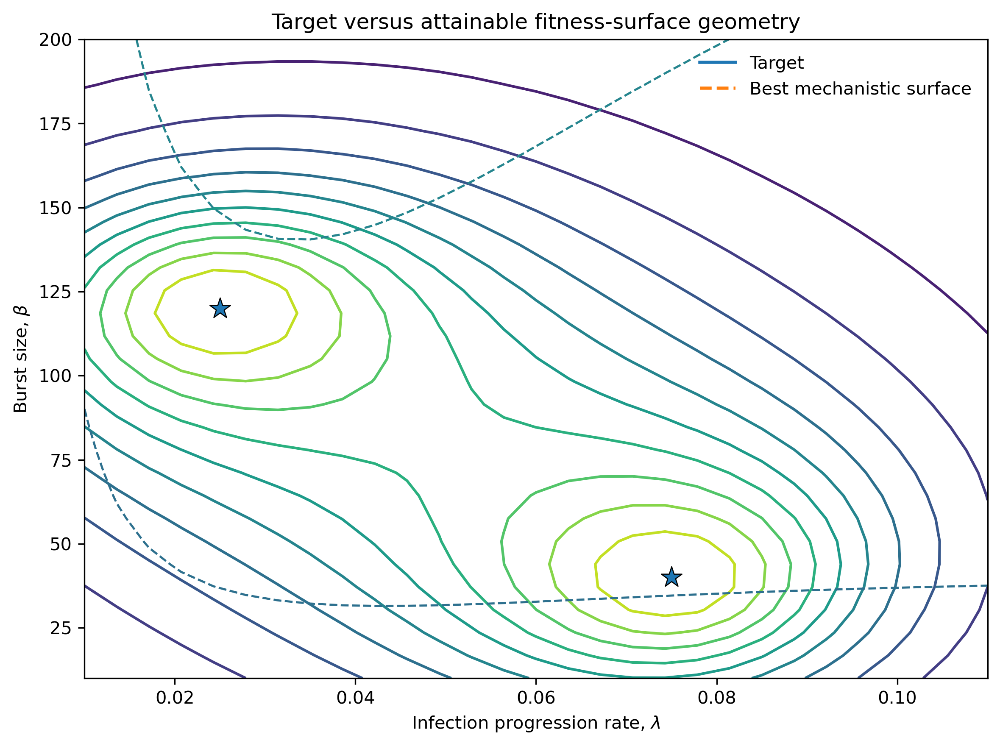

*Figure 10. 2D target surface with two optima, against the best single-environment surface over 75 restarts.*

**What does set the number of peaks.** With the trade-off $`\beta(\lambda)`$ made non-monotone by a Gaussian bump, the landscape has two peaks (bump amplitude 0.136 gave equal peaks, 0.30 gave a 1:2.4 ratio). This is a positive control: it changes the organism and not the environment, and the bump has no biological justification yet.

## 4. A sequence of environments reaches it

**Question.** If one environment cannot make two peaks, can a timed sequence of environments?

**Architecture.** Open-loop trajectory optimisation: the whole schedule is planned in advance and needs no measurements during the assay.

1. The assay is split into $`M`$ windows. The environment is constant within a window and changes between windows.
2. Each window's final state is the next window's initial state.
3. A **serial-transfer step** (dilute, add fresh hosts) is applied between windows.
4. The terminal loss is differentiated through every window, so early windows are chosen for their downstream effect. No reinforcement learning is needed.
5. Controls are bounded by smooth transforms; the loss is averaged over an ensemble of initial states.
6. The optimiser is **warm-started** from a bimodal schedule found by random search.

```
x₀ ─(u₁)─► x₁ ─transfer─(u₂)─► x₂ ─ … ─(u_M)─► x_M ──► F(λ) ──► loss against F*
      ▲            ▲                    ▲                           │
      └────────────┴──── gradients to every window ◄────────────────┘
```

Two design points turned out to be essential:

- **Host resupply.** Without the serial-transfer step, later windows do nothing: once hosts are consumed both phage populations decay at the same rate and $`V_1/V_2`$ is frozen. A second window changed the answer by 0.05%.
- **Long windows.** A window shorter than one latent period cannot complete a lysis cycle for slow phenotypes. Splitting a fixed horizon into five short windows destroyed the effect.

**Result.** Schedules produce bimodal landscapes that no static environment did: random search found them in a handful of 400 two-window schedules and in 0 of 200 static environments.

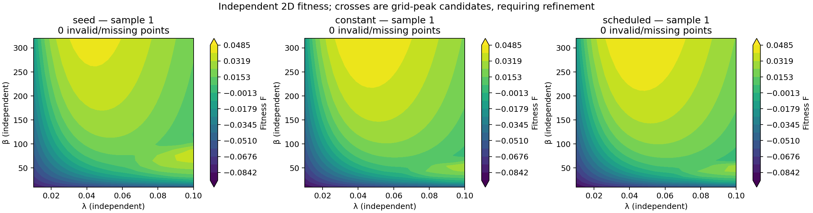

*Figure 11. Two windows: target surface, the best single environment and the optimised schedule.*

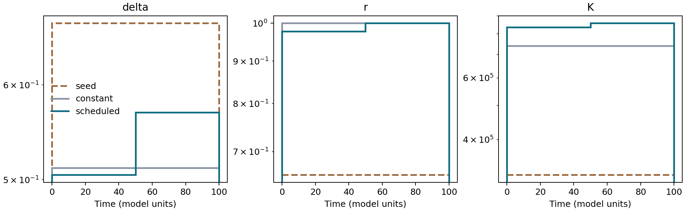

*Figure 12. The environment in each window of the optimised two-window schedule.*

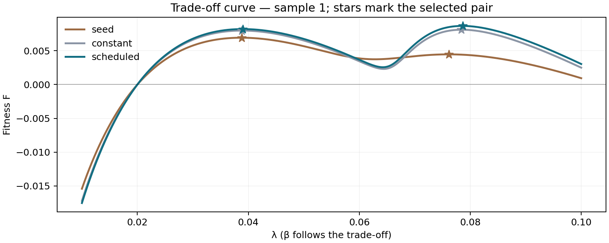

*Figure 13. Fitness along the trade-off curve $`\beta(\lambda)`$, the set of phenotypes the organism can actually reach.*

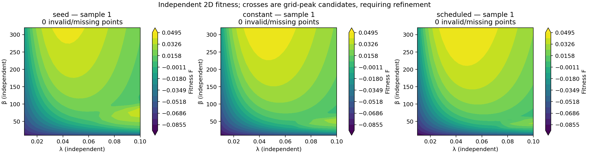

*Figure 14. The same comparison with three windows.*

**The baseline that matters.** A schedule with $`M`$ windows has $`M`$ times the parameters, so it must fit at least as well as one environment. Each schedule is compared with the best constant environment optimised with the same machinery and budget.

## 5. From sampling solutions to the shape of the solution space

ongoing work.

**Question.** Steps 2–4 find solutions by sampling: restarts, posterior draws, random schedules. Can we say something general about the set of solutions itself? Is it one connected region or several? Does it have holes? need persistent homology tools...

**Architecture.**

- **Point cloud.** Environments (or schedules) whose loss is below a tolerance, drawn from the multi-start runs and the flow posterior.
- **Persistent homology.** A filtration over that point cloud. Connected components that persist count separate families of solutions; persistent loops mark holes, regions of parameter space the solutions go around.
- **Comparison across targets.** The same summary computed for the dome, for bimodal targets and for schedules shows how the solution set changes as the target gets harder: whether it shrinks, splits or disappears.

<!-- Figure to add: persistence diagram and barcode for the dome solution set, beside a 2D projection of the point cloud. -->

> **Figure 15 (to come).** Persistence diagram of the solution set for the dome target.

---

## Limitations

- **Deterministic model only.** All results are for the ODE. Validation in the stochastic agent-based model has not been done.
- **"Out of reach" is scoped to this model.** The claim in step 3 is about this ODE with this trade-off over the sampled environments. Richer biology, such as several host classes, could create more than one optimum.
- **Bimodal schedules are rare.** The optimiser in step 4 needs a warm start from a schedule found by search.
- **The two-peak trade-off is phenomenological.**

## What is in this repository

Figures and the normalising-flow outputs. Source code and raw result tables are not included.

| Folder | Contents |
|---|---|
| `plots/` | Step 1, and the multi-start analysis of step 2 |
| `NF/nf_results/` | Step 2: simulations, posterior samples, validation and plots for the normalising flow |
| `plots_experiment0/` | Step 3, stage 0: forward sweep |
| `plots_experiment1/`, `plot_experiment1_200_sym/`, `plots_experiment2/` | Step 3, stages 1–2: 1D bimodal targets |
| `plots_experiment3*/`, `plots_exp3_*/` | Step 3, stage 3: 2D targets |
| `plots_open_loop/` | Step 4: schedules with two and three windows |

## Licence

MIT. See `LICENSE`.
